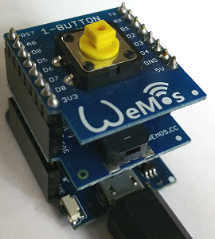

# Di mini: Einfaches Summer (Buzzer) Beispiel
Sketch: D1_Ex38_in3out5_buzzer, Version 2017-11-03   
[English Version](./README.md "English Version")

Solange der Taster an D3 gedr&uuml;ckt wird, summt der Summer (Buzzer).

## Hardware
* WeMos D1 mini
* Wemos Buzzer Shield (Vorgabewert Pin D5)
* Button Shield (Vorgabewert Pin D3)   

           