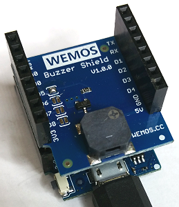

# Di mini: Alle meine Entchen als Buzzer Beispiel
Sketch: D1_Ex39_buzzersong, Version 2017-11-03   
[English Version](./README.md "English Version")

Nach dem Einschalten der Versorgungsspannung wird einmal das Lied "Alle meine Entchen" &uuml;ber den Buzzer abgespielt.

## Hardware
* WeMos D1 mini
* Wemos Buzzer Shield (Vorgabewert Pin D5)

           