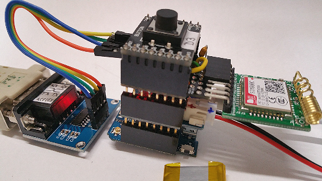
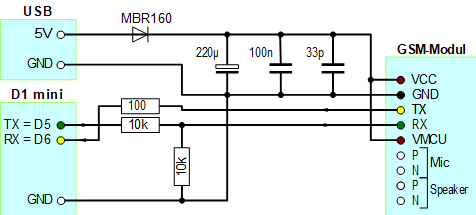
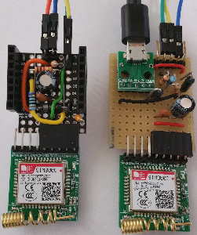

# D1 mini: Taster schickt SMS
Version 2018-12-15, Datei: `D1_Ex52_sws_sms_send1.ino`   
[English version](./README.md "English version")   

Das Dr&uuml;cken des Tasters D3 bewirkt das Senden einer SMS mit Hilfe eines Moduls "SIM800C GSM GPRS module STM32". 

## Hardware
1. WeMos D1 mini   
2. Battery Shield for WEMOS D1 mini mit kleinem Akku HM04S (3,7V 350mAh 1,3Wh)   
3. Selbstbau SIM800C 9pol ProtoBoard Shield mit angestecktem SIM800C GSM GPRS module STM32   
4. 1-Button Shield   

   
_Bild 1: D1mini mit Battery Shield, 9pol ProtoBoard Shield und 1-Button Shield. Links davon: 3,3V-RS232-Modul_ 

## Besonderheiten des Hardware-Aufbaus  
* Die Stromversorgung erfolgt &uuml;ber das Battery Shield, da der Spannungsstabilisator auf dem D1 mini nicht gen&uuml;gend (Spitzen-)Strom f&uuml;r das SIM-Modul liefert.   
* Der Anschluss des SIM-Moduls erfolgt &uuml;ber ein Selbstbau SIM800C 9pol ProtoBoard Shield und eine Software-Serial-Schnittstelle (D5=TX, D6=RX)   
* Der Anschluss eines PCs (zur Information) erfolgt &uuml;ber die TX/RX-Pins und einen 3,3V-RS232-Adapter.   
W&auml;hrend der Programmierung/Testphase kann dies auch &uuml;ber den USB-Anschluss und die Arduino-Programmieroberfl&auml;che erfolgen.   

## Vorbereiten des SIM-Moduls
* Zum Senden von SMS muss eine Micro-SIM-Karte in das SIM-Modul eingelegt werden. Diese kann in &Ouml;sterreich zB eine Pre-Paid-SIM von Drei oder B.free sein.   
* Ob die SIM-Karte vom Modul erkannt wird, kann zB durch Abfragen der SIM-Kartennummer festgestellt werden:   
`AT+CCID`   
* Welche Provider-Netze zur Verf&uuml;gung stehen, kann durch folgenden Befehl festgestellt werden:   
`AT+COPS=?`   
* Die Kontrolle, ob man in einem Netz eingew&auml;hlt ist erfolgt durch   
`AT+COPS?` (ohne Gleichheitszeichen)   

## Ansteuerung des SIM-Moduls
Ist das SIM-Modul angesteckt, so gibt die rote LED Hinweise zum Modul-Zustand:   
* Blinkt sie in kurzen Abst&auml;nden, ist sie beim Booten oder beim Versuch, sich in das Provider-Netz einzuloggen.
* Blitzt sie kurz im Abstand von ca. 3 Sekunden auf, ist sie zum Senden und Empfangen von SMS bereit.   
Kommt es w&auml;hrend des SMS-Sendevorgangs zum schnellen Blinken der LED, dann bootet das SIM-Modul neu. Das deutet darauf hin, dass die Stromversorgung zu schwach ist.

Die Software-Ansteuerung des SIM-Moduls erfolgt grunds&auml;tzlich durch Senden von AT-Befehlen. Zum &Uuml;berpr&uuml;fen des SIM-Moduls und zum Senden der SMS werden daher folgende drei AT-Befehle &uuml;ber die (Software-) serielle Schnittstelle gesendet:   
| Befehl | Bedeutung |   
| -----  | ----- |   
| `ATE1` | Test, ob ein Modem angeschlossen ist und zur&uuml;cksenden der empfangenen Befehle (Echo). Die Antwort sollte "OK" sein. |    
|`AT+CMGF=1` | Umstellen des SMS-Formats auf Text. |    
| `AT+CMGS="0680xxxxxxx"` | Senden einer SMS. Nach Eingabe des Befehls erscheint als Eingabeaufforderung ein Gr&ouml;&szlig;erzeichen &gt;, worauf der SMS-Text eingegeben werden kann. <br>__Wichtig__: Der SMS-Text muss mit &lt;Strg&gt;Z = 0x1A abgeschlossen werden! |       

###__*Beispiel-Ausdruck von der seriellen Schnittstelle eines PCs*__
```
2018-12-15 D1_Ex52_sws_sms_send1
Press D3 to send a SMS
-----Init Modem-----
len=11: ATE1

OK

len=16: AT+CMGF=1

OK

len=54: AT+CPMS="ME","ME","ME"

+CPMS: 5,50,5,50,5,50

OK

len=24: AT+CNMI=2,1,2,1,0

OK

-----Modem OK-----
-----Button pressed!-----
len=74: 2018-12-15 D1_Ex52_sws_sms_send1
> Up-Time: 8298ms
> 
+CMGS: 54

OK

-----Sent finished-----
```

##Selbstbau SIM800C 9pol ProtoBoard Shield
Das SIM-Modul "SIM800C GSM GPRS module STM32" hat einige elektrische Besonderheiten:   
* Versorgungsspannung 3,4V bis 4,4V (NICHT 3,3V und NICHT 5V).   
Stromversorgung mit 3.7 V Lithium Akku ist laut H&auml;ndlerbeschreibung m&ouml;glich.
* Kurzzeitig sehr hoher Stromverbrauch beim SMS-Senden (bis zu 2A).
* Serieller Port Input: low -0,3..0,7V, high 2,1...3,1V   
Auch wenn in der H&auml;ndler-Beschreibung "Kompatibel mit 5V und 3V3 Systemen" steht, stimmt das nicht. Betr&auml;gt die Spannung an RX/TX 3,3V, so kommt es immer wieder zu Boot-Vorg&auml;ngen, speziell beim Versuch, eine SMS zu schicken.   
Auf der seriellen Schnittstelle wird dann pl&ouml;tzlich "Call Ready" und "SMS ready" ausgegeben und die rote LED blinkt.   

Aus diesem Grund ist es erforderlich, eine Spannungsanpassungsschaltung zu erstellen (Voltage Interface Board). Der Aufbau kann auf einem ProtoBoard oder einer Lochrasterplatine erfolgen.   

   
_Bild 2: Schaltung des SIM800C 9pol ProtoBoard Shield_   
Statt des USB-Anschlusses kann auch der 5V-Pin des D1 mini verwendet werden, wenn die Stromversorgung &uuml;ber ein Battery Shield erfolgt.

 ")      
_Bild 3: Prototypen der Interface Boards (Bauteil- und L&ouml;tseite)_   
Anmerkung: Bei der Bauteilplatzierung gibt es Optimierungspotenzial ;)

"SIM800C 9pol ProtoBoard Shield" (links im Bild): Oben ist der Anschluss f&uuml;r die serielle Hardware-Schnittstelle herausgef&uuml;hrt (RX-TX-GND-3V3).   
Lochrasterplatine (rechts im Bild): Die Stromversorgung des SIM-Moduls erfolgt &uuml;ber einen eigenen USB-Anschluss. Der Mikrocontroller (zB Raspberry Pi) ist &uuml;ber RX-TX-GND verbunden

