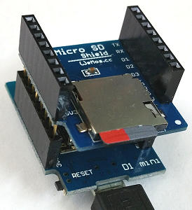

# D1 mini: Info about microSD card in Micro SD Shield
Sketch: D1_Ex40_SD_cardinfo, Version 2017-11-05   
[Deutsche Version](./LIESMICH.md "Deutsche  Version")

Based on code by Limor Fried and Tom Igoe. See https://github.com/esp8266/Arduino/blob/master/libraries/SD/examples/CardInfo/CardInfo.ino

When D1 mini starts, on Serial is displayed:
* if there is inserted a micro SD card into Micro SD Shield,
* type of sd card (SD1, SD2 oder SDHC),
* type of volume format (FAT16 or FAT32)
* number of blocks, clusters and size of the first FAT-type volume
* a file list of root directory with date and size

## Hardware
* WeMos D1 mini
* Micro SD Shield

   

### Output on Serial
```
PART 1: Initializing SD card...
Wiring is correct and a card is present.
Card type: SDHC

PART 2: volume info
Volume type: FAT32
Block size: 512 byte (fix)
Number of blocks per cluster: 16
Number of clusters: 1942528
Volume size (KBytes): 15540224
Volume size (MBytes): 15176
Volume size (GBytes): 14

PART 3: Files found on the micro SD card.
--filename.ext |---date---|--time--|size in bytes
  SYSTEM~1/     2017-11-04 19:55:08
  WPSETT~1.DAT  2017-11-04 19:55:08 12
  INDEXE~1      2017-11-04 19:55:12 76
```

---

## FAT32 Formatting a micro SD card with windows
Note: card size must be 512MB to 32GB!   
Smaler card volums: Format FAT16   
Larger card volums : Use   
`https://www.heise.de/download/product/h2format-40825` (for not formatted cards) or   
`http://www.heise.de/download/fat32formatter.html`   
&nbsp;   

__For card size 512MB to 32GB__   
1. Insert micro SD card
2. Open Windows command prompt __as Administrator__.   
(click right mouse button on`C:\Windows\System32\cmd.exe` as Administrator)
3. Start partition manager by typing `diskpart`   
4. Show volums list by typing `list disk`   
__Important__: Remember the number of disk, you want to format (e.g. 5)   
5. Choose disk by typing `select disk 5` (use the correct number!).   
6. Delete all data on selected disk by typing `clean`   
7. Make a partition by typing `create partition primary`   
8. Format micro SD card by typing `format fs=fat32 quick`   
9. Optional: Choose Windows Letter by typing `assign letter=X`, where X is the letter you want.   
10. Exit program by typing `exit`.   

*Source: http://www.giga.de/downloads/windows-10/tipps/loesung-windows-konnte-die-formatierung-nicht-abschliessen-fehler-beheben/*
