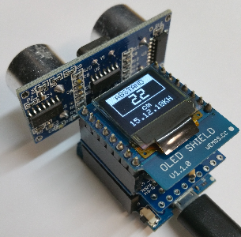
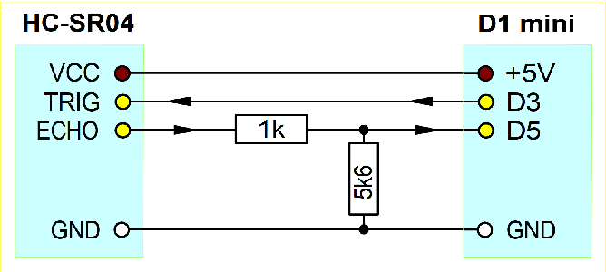
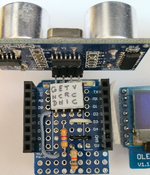
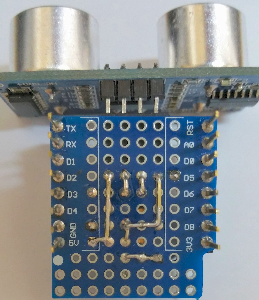

# Di mini: Abstandmessung mit Ultraschallsensor HC-SR04
Version 2018-11-16, Datei: `D1_Ex49_SR04_pulseIn_oled.ino`   
[English version](./README.md "English version")   

Der mit dem Ultraschallsensor HC-SR04 gemessene Abstand wird auf dem 0.66" OLED in cm angezeigt.   
   
_Bild 1: D1mini mit Adapter und Ultraschallsensor HC-SR04_ 

## Hardware
1.  WeMos D1 mini   
2.  Eigenbau ProtoBoard SR04-Adapter mit Ultraschallsensor HC-SR04   
3.  OLED Shield 0.66"   

   
_Bild 2: Schaltung des D1mini Adapters f&uuml;r Ultraschallsensor HC-SR04_ 

   
_Bild 3: Bauteilseite des HC-SR04-Adapters_ 

   
_Bild 4: L&ouml;tseite des HC-SR04-Adapters_ 

## Software
Zur Ansteuerung des OLED wird die Klasse `Screen1` verwendet.   
(Siehe Verzeichnis `src`)   

