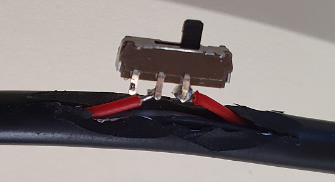
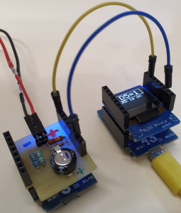

# D1 mini: 5V input with voltage monitoring
Sketch: D1_ex56_5VinMonitor1.ino, Version 2021-02-27   
[--> Deutsche Version](./LIESMICH.md "Deutsche Version")   

This program is used to test the self-made shield `D1_5VinMonitor1` and to measure how long the D1 mini continues to work after the supply voltage is switched off (switch-off delay). For this purpose the 5V power supply must be connected via the shield and not via the USB connector.   
After power-on pin D5 is set to 1, the blue LED flashes with 0.5Hz and the system state is output via the serial interface (e.g. `D5=1__LED is on__`). The time control is done with a 10ms counter.   
If the supply voltage is switched off, D5 goes to 0, the LED is switched on, the 10ms counter is set to 0 and the counter value is sent as a millisecond value via the serial interface until the energy stored in the capacitor is used up.   
__*Example output on the serial interface*__
```   
D5=1__LED is on__
D5=1__LED is off__
D5=1__LED is on__
D5=0__LED is on!
00ms
10ms
20ms
30ms
40ms
50ms
60ms
70ms
80ms
90ms
100ms
110ms
120ms
130ms
140ms
150ms
160ms
170ms
180ms
190ms
Exception in thread rx:
...
```   
### Displaying the serial output   
To make the characters sent over the serial interface visible (as in the example output above), there are several possibilities:   
* Connecting the TX and GND pins via a level converter to the serial port of a PC, laptop etc. and displaying the information with a terminal program (e.g. Realterm).   
* Use a USB cable where the 5V line is interrupted or can be interrupted (e.g. by a switch) (see figure 1). The values can then be displayed in the monitor of the programming software (Arduino IDE, Visual Studio Code, ...).   
    
_Fig. 1: USB cable with switch in 5V line_   
* Using a second D1 mini with 0.66" OLED shield, running the program `D1_oop89_serial_screen13` and connecting TX to RX and GND to GND. The info is then shown on the OLED (see figure 2).   
    
_Image 2: D1 mini with D1_5VinMonitor1 shield and D1 mini with 0.66" OLED shield_
